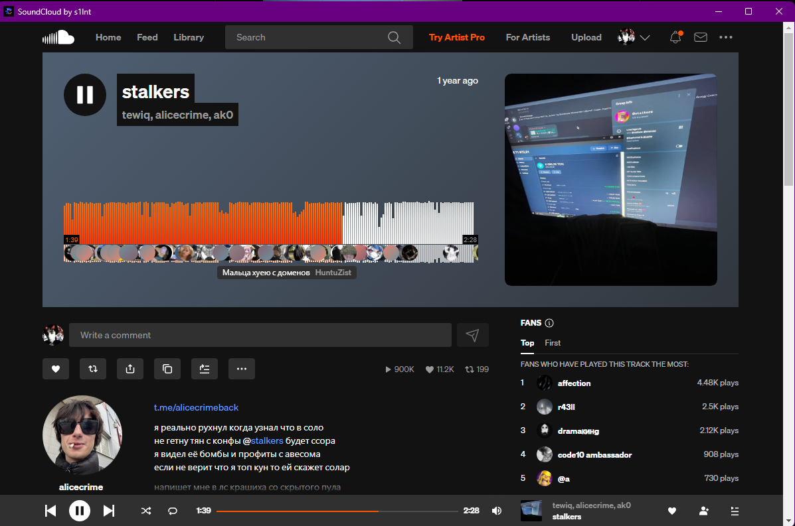

# ☁️ SoundCloud Desktop for Windows + Discord RPC

Удобный десктопный клиент для SoundCloud с полноценной интеграцией в Discord. Теперь твои друзья увидят, что ты слушаешь, в реальном времени.

**-==- Discord RPC Preview -==-**

 

**-==- SoundCloud Desktop Preview -==-**



## ✨ Особенности
* **Rich Presence**: Отображение названия трека, исполнителя и обложки в твоем статусе Discord.
* **Progress Bar**: Живая полоса прокрутки прямо в профиле.
* **Portable**: Не требует установки. Скачал, запустил, слушаешь.


## 🚀 Как пользоваться
1. Зайди в раздел [Releases](https://github.com/sylent345/soundcloud-desktop/releases).
2. Скачай архив `soundcloud.zip` // `soundcloud.7z`
3. Распакуй архив
4. Запусти SoundCloud Desktop.exe (убедись, что Discord открыт).
5. Слушай песенке.

## Telegram (max) канал
[t.me/archiv33d](https://t.me/archiv33d)


## 🛠️ Для разработчиков (Сборка из исходников)
Если хочешь собрать проект сам:
```bash
# Клонировать репозиторий
git clone [https://github.com/sylent345/soundcloud-desktop.git](https://github.com/sylent345/soundcloud-desktop.git)

# Установить зависимости
npm install
npm install discord-rpc

# Запустить в режиме отладки
npm start

# Собрать свой .exe
npm run dist
